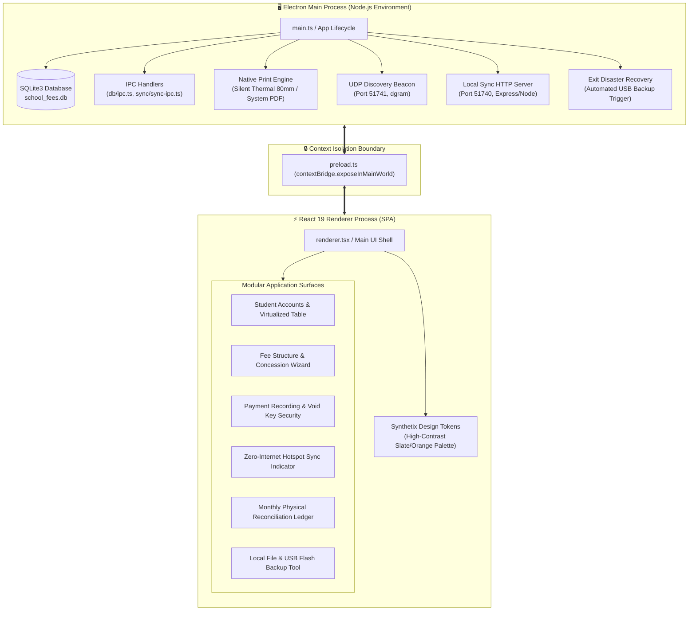
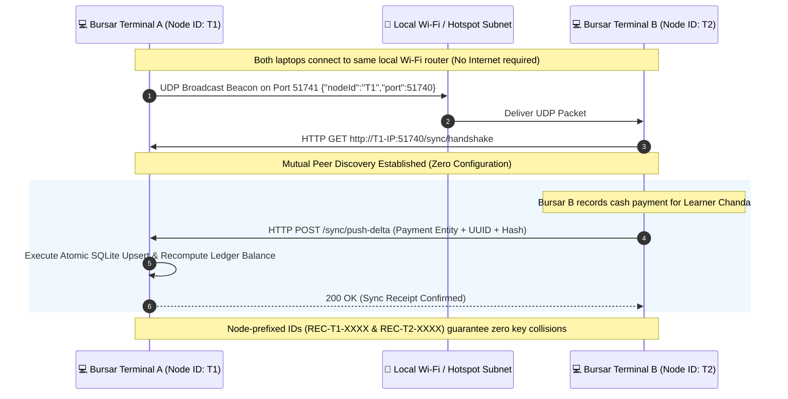
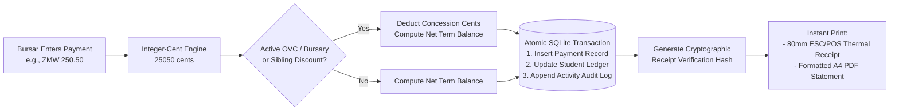

<p align="center">
  
</p>

<h1 align="center">School Foundry (Offline Desktop DPG Edition) 🎓</h1>

<p align="center">
  <strong>An Open-Source, Offline-First Digital Public Good (DPG) for Last-Mile Educational Continuity & School Administration</strong>
</p>

<p align="center">
  <a href="LICENSE"></a>
  <a href="docs/dpg-compliance/DPGA_STANDARD_ALIGNMENT.md"></a>
  <a href="https://sdgs.un.org/goals/goal4"></a>
  <a href="https://sdgs.un.org/goals/goal10"></a>
  <a href="#-system-architecture"></a>
  <a href="https://github.com/Jiggabyte-Technology-Limited/school-foundry/releases/tag/v1.1.0"></a>
  
</p>

---

## 🌍 Problem & Mission

Across Sub-Saharan Africa, **over 65% of primary schools operate without electrical grid stability** (UNESCO UIS) and **over 80% lack pedagogical internet connectivity** (UNICEF/ITU Giga Initiative). 

In these off-grid, low-connectivity environments:
1. **Administrative Failure & Dropouts**: Schools rely on fragile paper ledgers and manual spreadsheets. When student records or fee payments cannot be verified during blackouts, children—especially vulnerable girls and orphans—are wrongfully barred from classes or exam halls.
2. **Institutional Financial Vulnerability**: Independent audits reveal that under-resourced schools lose **10%–20% of operational revenue to unrecorded transactions and reconciliation disputes**, threatening teacher retention and school survival.
3. **The SaaS Digital Divide**: Modern EdTech platforms require continuous broadband and per-student cloud subscriptions, excluding low-fee community and public schools.

**School Foundry** is an offline-first, zero-dependency school management platform developed in Zambia by **Jiggabyte Technology Limited**. It enables primary, secondary, and community schools to maintain permanent student records, track vulnerable student subsidies (OVC), execute transparent fee reconciliation, issue cryptographic receipts, and synchronize across bursar laptops over local hotspot networks—**with zero internet connection required**.

---

## 🏛️ System Architecture

School Foundry is built with an **Electron + React 19 + Local SQLite3** architecture designed for absolute data sovereignty, single-file backups, and hardware-accelerated local performance.



---

## 📡 Zero-Internet Local Hotspot Sync Protocol

School Foundry eliminates the need for cloud databases by allowing bursars in the same administrative office to sync records over a **local Wi-Fi router or Windows Mobile Hotspot without internet access**:



---

## 💰 Integer-Cent Financial Arithmetic & Audit Trail

To protect under-resourced schools from floating-point rounding errors and administrative fraud:



---

## 📂 Repository File Structure

```text
school-foundry-offline/
├── build/                              # Packaging scripts & NSIS installer definitions
│   └── uninstaller.nsh                # Custom uninstaller hooks
├── docs/                              # 📚 Comprehensive Documentation Hub
│   ├── README.md                      # Documentation Master Index
│   ├── architecture/                  # Technical Architecture Blueprints
│   │   ├── ARCHITECTURE.md            # Main/Renderer IPC & Electron lifecycle
│   │   ├── DATABASE_SCHEMA.md         # Full relational tables, indexes & FKs
│   │   ├── SYNC_ENGINE.md             # UDP hotspot beacon & HTTP delta replication
│   │   └── TECH_STACK.md              # Deep breakdown of runtime libraries
│   ├── dpg-compliance/                # Digital Public Goods & Legal Compliance
│   │   ├── DATA_PROTECTION_AND_PRIVACY.md # Zambian Data Protection Act No. 3 of 2021
│   │   ├── DPGA_STANDARD_ALIGNMENT.md # DPGA 9-Indicator self-assessment
│   │   └── UNICEF_VENTURE_FUND.md     # UNICEF Venture Fund $100k application dossier
│   ├── gtm/                           # Commercial & Distribution Strategy
│   │   ├── MARKETING_AND_DISTRIBUTION.md # Adopt-a-School donor models & hardware kits
│   │   └── WHATSAPP_OUTREACH_PLAYBOOK.md # Headmaster conversational outreach scripts
│   └── guides/                        # Operational Runbooks & Manuals
│       ├── BURSAR_QUICK_START_GUIDE.md# 1-page daily bursar desk routine
│       ├── BRANDING_GUIDE.md          # Design tokens, typography & receipt guidelines
│       ├── QUICK_REFERENCE.md         # Keyboard shortcuts & error recovery cheat sheet
│       └── USER_GUIDE.md              # End-to-end module administrator guide
├── public/                            # Static application assets & icons
│   └── img/                           # Brand vector & bitmap graphics
├── release/                           # Production builds & NSIS executable installers
├── scripts/                           # Database maintenance & demo seeding scripts
│   ├── clear-prod-db.js               # Clean-slate DB initializer for builds
│   └── seed-demo-data.js              # 200+ realistic student demo records generator
├── src/                               # ⚡ Application Source Code
│   ├── main.ts                        # Electron Main process entrypoint
│   ├── preload.ts                     # Context isolation IPC bridge
│   ├── renderer.tsx                   # React 19 SPA entrypoint & view router
│   ├── declarations.d.ts              # Global TypeScript window & API typings
│   ├── components/                    # Modular React UI components
│   │   ├── BackupManager.tsx          # USB flash drive & local disk backup manager
│   │   ├── FeeStructureManager.tsx    # Term fee tier & category setup modal
│   │   ├── MonthlyReconciliationLedger.tsx # Physical monthly paper safe-box audit sheet
│   │   ├── SettingsModal.tsx          # School branding, currency & supervisor key config
│   │   ├── SetupWizard.tsx            # First-run onboarding & school profile wizard
│   │   ├── StudentWizard.tsx          # New learner registration & enrollment form
│   │   ├── TopBar.tsx                 # Header navigation & search interface
│   │   ├── UserGuide.tsx              # Embedded in-app user documentation modal
│   │   ├── auth/                      # Authentication & password recovery views
│   │   ├── payments/                  # Multi-period payment dialogs & voiding controls
│   │   ├── setup-wizard/              # Grade level & academic structure action handlers
│   │   ├── student-accounts/          # Virtualized learner ledger table & search filters
│   │   ├── sync/                      # Real-time local hotspot sync status indicator
│   │   └── ui/                        # Reusable atomic UI elements & Synthetix cards
│   ├── db/                            # SQLite schema, migrations & IPC handlers
│   │   ├── init.ts                    # SQLite database initializer & WAL configurator
│   │   ├── ipc.ts                     # Main-process IPC database query bridge
│   │   ├── migrations.ts              # Upward database schema migration manager
│   │   ├── schema.sql                 # Canonical SQLite DDL table definitions
│   │   └── import-ipc.ts              # CSV & Excel bulk student intake parser
│   ├── lib/                           # Core utilities, financial logic & printing
│   │   ├── auth-context.tsx           # React authentication state provider
│   │   ├── currency.ts                # Integer-cent currency formatting & conversions
│   │   ├── db-client.ts               # Type-safe renderer-side database client
│   │   ├── print-service.ts           # Silent thermal & system print coordinator
│   │   ├── fees/                      # Concession, subsidy, rollover & reminder algorithms
│   │   ├── import/                    # Spreadsheet column mapping & validation engine
│   │   └── print/                     # HTML/CSS templates for receipts, ledgers & statements
│   ├── sync/                          # Zero-internet local hotspot synchronization
│   │   ├── node-identity.ts           # Unique terminal ID generator & node prefixing
│   │   ├── sync-engine.ts             # Bidirectional delta replication orchestrator
│   │   ├── sync-ipc.ts                # Main-to-renderer sync event bridges
│   │   ├── sync-server.ts             # Embedded HTTP sync REST server (port 51740)
│   │   └── udp-beacon.ts              # Automatic peer subnet discovery beacon (port 51741)
│   └── theme/                         # Synthetix design system CSS tokens
├── CODE_OF_CONDUCT.md                 # Contributor Covenant Code of Conduct
├── CONTRIBUTING.md                    # Open-source contribution guidelines
├── LICENSE                            # MIT Open-Source License
├── package.json                       # Dependencies & build configuration
├── README.md                          # 📍 Repository Master Overview
├── SECURITY.md                        # Vulnerability disclosure policy
└── tsconfig.json                      # Strict TypeScript compiler options
```

---

## 🚀 Key Functional Capabilities

### 👨‍🎓 1. Learner & Enrollment Lifecycle
- **Persistent Multi-Year Registry**: Tracks students across multiple academic years with complete historical records.
- **Child Welfare & OVC Concessions**: Flags Orphaned & Vulnerable Children (OVC) and Free Education Policy grant recipients to eliminate wrongful class exclusions.
- **Academic Year Promotions**: Automated end-of-year rollover module promoting learners to subsequent grades while carrying forward unsettled balances.

### 💳 2. High-Integrity Bursar Operations
- **Payment Period Allocation**: Bursars can record single payments that span multiple terms (e.g. paying Term 1 and Term 2 simultaneously).
- **Supervisor-Guarded Voiding**: Reversing mistaken payments requires supervisor override credentials with mandatory audit logging.
- **Instant Dual-Format Printing**: Produces 80mm ESC/POS thermal receipts and full A4 PDF statements with cryptographic checksums.

### 🛡️ 3. Physical & Digital Disaster Recovery
- **Exit USB Backup Trigger**: Automatically reminds bursars upon closing the app to mirror the database to an external USB flash drive.
- **Physical Reconciliation Ledger**: Generates a standardized monthly paper reconciliation sheet with signature blocks for physical filing in the school safe box.

### 📶 4. Zero-Internet Hotspot Multi-Terminal Sync
- **Automatic Peer Discovery**: Bursar laptops automatically connect over the school's local Wi-Fi router or a mobile phone hotspot.
- **Conflict-Free Delta Replication**: UUID-keyed records prevent duplicates even if multiple operators record transactions at the same time.

---

## ⚡ Getting Started

### Prerequisites
- [Node.js](https://nodejs.org/) (v18 or v20 LTS)
- [npm](https://www.npmjs.com/)

### Installation & Development
```bash
# 1. Clone the repository
git clone https://github.com/Jiggabyte-Technology-Limited/school-foundry.git
cd school-foundry

# 2. Install dependencies
npm install

# 3. Launch in development mode (Electron + React Vite HMR)
npm run dev
```

### 100% Free Open-Source DPG Edition
School Foundry is completely free and open-source under the MIT License. On first launch, the app directly launches the Welcome & Setup Wizard—**no license keys, machine activation, or cloud accounts required**.

### Building the Standalone Production Installer
```bash
# Build standalone Windows installer (.exe)
npm run build
```
The compiled Windows NSIS installer will be output to the `release/` directory:
- `release/SchoolFoundry Setup 1.1.0.exe`

---

## 📚 Documentation Directory

Every aspect of the platform is extensively documented in the **[Documentation Hub](docs/README.md)**:

| Category | Guides & Specifications |
| :--- | :--- |
| **Technical Architecture** | [Architecture Overview](docs/architecture/ARCHITECTURE.md) • [Database Schema](docs/architecture/DATABASE_SCHEMA.md) • [Local Hotspot Sync Engine](docs/architecture/SYNC_ENGINE.md) • [Tech Stack](docs/architecture/TECH_STACK.md) |
| **Operational Guides** | [Bursar Quick Start Guide](docs/guides/BURSAR_QUICK_START_GUIDE.md) • [Comprehensive User Guide](docs/guides/USER_GUIDE.md) • [Quick Reference Card](docs/guides/QUICK_REFERENCE.md) • [Branding Guide](docs/guides/BRANDING_GUIDE.md) |
| **DPG & Compliance** | [DPGA Alignment Dossier](docs/dpg-compliance/DPGA_STANDARD_ALIGNMENT.md) • [Data Protection & Privacy Policy](docs/dpg-compliance/DATA_PROTECTION_AND_PRIVACY.md) • [UNICEF Venture Fund Proposal](docs/dpg-compliance/UNICEF_VENTURE_FUND.md) |
| **Commercial & Outreach**| [Marketing & Distribution](docs/gtm/MARKETING_AND_DISTRIBUTION.md) • [WhatsApp Outreach Playbook](docs/gtm/WHATSAPP_OUTREACH_PLAYBOOK.md) |

---

## 🤝 Contributing

We welcome contributions from educators, software engineers, and child welfare advocates across Africa and globally! Please read our [Contributing Guidelines](CONTRIBUTING.md) and [Code of Conduct](CODE_OF_CONDUCT.md).

---

## 📝 License

School Foundry is free, open-source software licensed under the **[MIT License](LICENSE)**.

Developed in Zambia by **Jiggabyte Technology Limited**.
